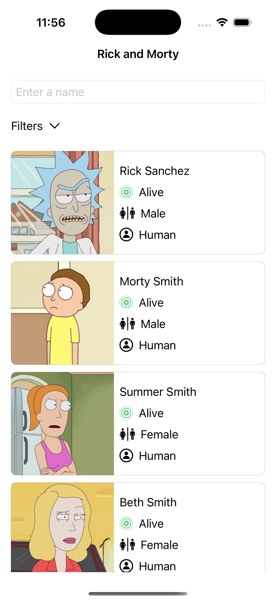
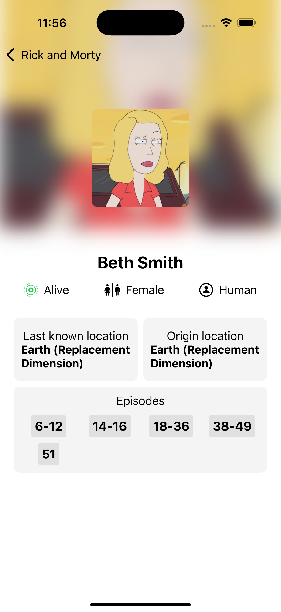

# Rick and Morty technical iOS test

This project is an iOS application built using Swift and SwiftUI. It fetches data from the Rick and Morty API to display information about characters, episodes, and locations from the popular TV show. The app was developed as part of a technical test.

## Screenshots

  
  

## Technologies Used

- **Language:** Swift
- **UI Framework:** SwiftUI

## Rick and Morty API

The app uses the [Rick and Morty API](https://rickandmortyapi.com/) to fetch data.

## Cache System

The app implements an in-memory cache system. While the user navigates through the app, responses from API calls are cached in memory to enhance performance and reduce redundant network requests.

This system could be modified to implement persistent caching, allowing data to be stored locally and remain accessible even if the user terminates the app.

## Development Environment

- Compiled with Xcode 16.1

